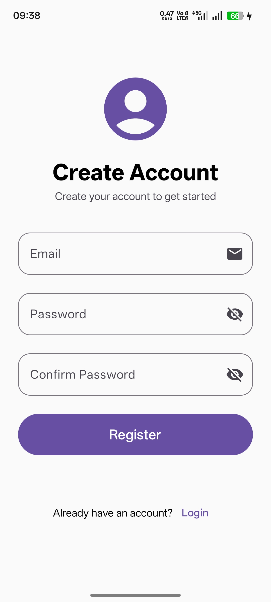
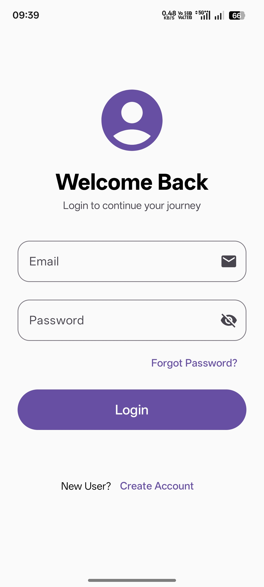
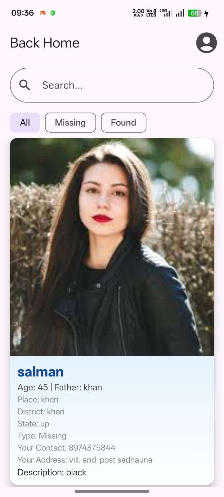
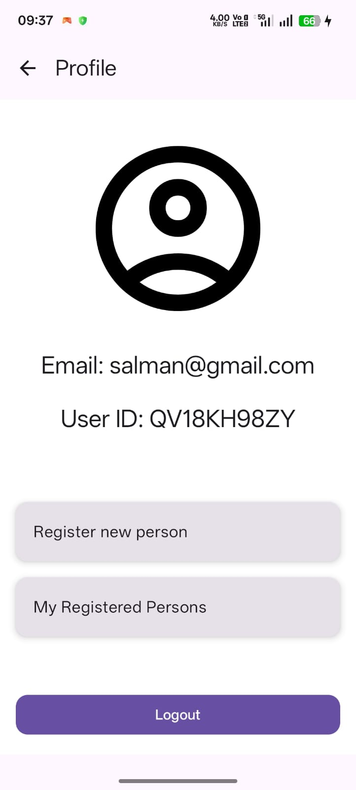
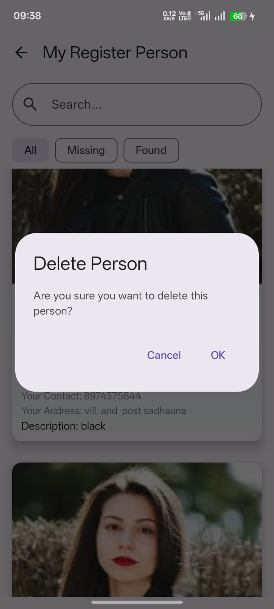

# 🏠 BackHome

BackHome is an Android application developed using **Kotlin**, **Jetpack Compose**, and **Firebase** to help reunite missing people with their families.

When a person goes missing, a family member, friend, or any responsible person can register the individual's information by selecting the **Missing** category. Similarly, if someone finds an unidentified person, they can register that person's details under the **Found** category.

The application stores both **Missing** and **Found** records securely in Firebase. Users can browse these records and compare the information to identify possible matches, making it easier to reconnect missing individuals with their families.

The primary goal of BackHome is to provide a simple, reliable, and community-driven platform for reporting and identifying missing or found persons.

---

# ✨ Features

- 🔐 Secure User Authentication using Firebase Authentication
- 👤 User Registration & Login
- 🚨 Register Missing Person Details
- 🤝 Register Found Person Details
- 📝 Detailed Person Registration Form
- 📋 View All Registered Persons
- 🗑️ Delete Your Registered Records
- ☁️ Real-time Data Storage using Firebase Firestore
- 📱 Modern UI built with Jetpack Compose
- ⚡ MVVM Architecture with Hilt Dependency Injection

---

# 📱 Application Workflow

1. A user creates an account and logs into the application.
2. If someone goes missing, the user registers that person by selecting the **Missing** category.
3. If another user finds an unidentified person, they register the person's information under the **Found** category.
4. Both Missing and Found records become available inside the application.
5. Users can compare the information and identify possible matches.
6. The owner of a registered record can manage or delete it whenever required.

---

# 🛠️ Tech Stack

| Technology | Usage |
|------------|-------|
| Kotlin | Programming Language |
| Jetpack Compose | Modern Android UI |
| Firebase Authentication | User Authentication |
| Cloud Firestore | Database |
| Firebase Storage | Image Storage |
| Hilt | Dependency Injection |
| MVVM | Architecture Pattern |
| Navigation Compose | Screen Navigation |

---

# 📸 Application Screenshots

<table>
<tr>
<td align="center">
<b>Register Screen</b><br><br>

</td>

<td align="center">
<b>Login Screen</b><br><br>

</td>
</tr>

<tr>
<td align="center">
<b>Home Screen</b><br><br>

</td>

<td align="center">
<b>Profile Screen</b><br><br>

</td>
</tr>

<tr>
<td align="center">
<b>Missing / Found Registration Form</b><br><br>

</td>

<td align="center">
<b>My Registered Persons</b><br><br>

</td>
</tr>
</table>

---

# 📖 Screen Description

### 🔹 Register Screen
Allows new users to create an account using Firebase Authentication before accessing the application.

### 🔹 Login Screen
Existing users can securely log into the application and access all available features.

### 🔹 Home Screen
The dashboard provides quick navigation to Missing Persons, Found Persons, Profile, and other sections of the application.

### 🔹 Profile Screen
Displays user information and account-related options.

### 🔹 Missing / Found Registration Form
Users can submit complete information about a missing or found person, including personal details and other relevant information.

### 🔹 My Registered Persons
Displays all records submitted by the logged-in user. Users can review or delete their own records whenever necessary.

---

# 🚀 Future Improvements

- 📍 Live location tracking
- 🔔 Push notifications
- 🤖 AI-powered face recognition
- 📷 Image similarity matching
- 🗺️ Google Maps integration
- 📞 One-click contact with the reporter
- 👮 Admin verification system
- 🔍 Advanced search and filtering
- 🌐 Multi-language support

---

# 📂 Project Structure

```
BackHome
│
├── app
├── screenshots
│   ├── register.jpeg
│   ├── login.jpeg
│   ├── homepage.jpeg
│   ├── profile.jpeg
│   ├── from.jpeg
│   └── delete.jpeg
│
├── README.md
└── build.gradle
```

---

# ⚙️ Getting Started

1. Clone the repository

```bash
git clone https://github.com/salmankhan-dev01/backhome.git
```

2. Open the project in Android Studio.

3. Add your Firebase configuration (`google-services.json`).

4. Sync Gradle.

5. Run the application on an Android device or emulator.

---

# 👨‍💻 Developer

**Mo Salman Khan**

Android  Developer

📧 **Email:** salmankhan.dev01@gmail.com

GitHub: https://github.com/salmankhan-dev01

LinkedIn: https://www.linkedin.com/in/mo-salman-khan-1899982a1/

---

## ⭐ If you like this project, don't forget to give it a Star!